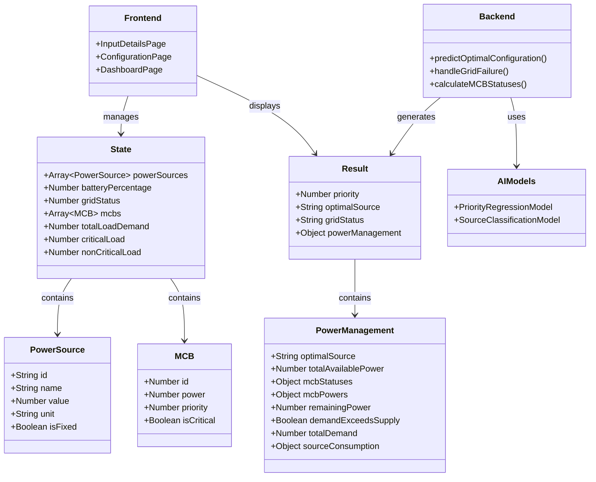

```mermaid
classDiagram
    class PowerSource {
        +String id
        +String name
        +Number value
        +String unit
        +Boolean isFixed
    }
    
    class MCB {
        +Number id
        +Number power
        +Number priority
        +Boolean isCritical
    }
    
    class State {
        +Array~PowerSource~ powerSources
        +Number batteryPercentage
        +Number gridStatus
        +Array~MCB~ mcbs
        +Number totalLoadDemand
        +Number criticalLoad
        +Number nonCriticalLoad
    }
    
    class Result {
        +Number priority
        +String optimalSource
        +String gridStatus
        +Object powerManagement
    }
    
    class PowerManagement {
        +String optimalSource
        +Number totalAvailablePower
        +Object mcbStatuses
        +Object mcbPowers
        +Number remainingPower
        +Boolean demandExceedsSupply
        +Number totalDemand
        +Object sourceConsumption
    }
    
    class Frontend {
        +InputDetailsPage
        +ConfigurationPage
        +DashboardPage
    }
    
    class Backend {
        +predictOptimalConfiguration()
        +handleGridFailure()
        +calculateMCBStatuses()
    }
    
    class AIModels {
        +PriorityRegressionModel
        +SourceClassificationModel
    }
    
    State --> PowerSource : contains
    State --> MCB : contains
    Result --> PowerManagement : contains
    Frontend --> State : manages
    Frontend --> Result : displays
    Backend --> AIModels : uses
    Backend --> Result : generates
```
