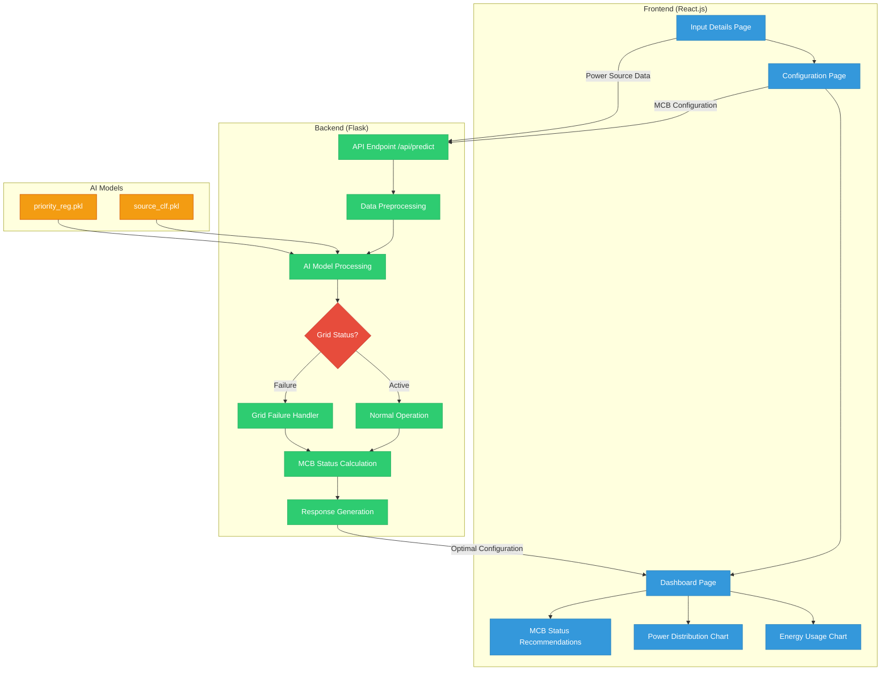

```mermaid
flowchart TD
    subgraph "Frontend (React.js)"
        A[Input Details Page] --> B[Configuration Page]
        B --> C[Dashboard Page]
        C --> D[Energy Usage Chart]
        C --> E[Power Distribution Chart]
        C --> F[MCB Status Recommendations]
    end
    
    subgraph "Backend (Flask)"
        G[API Endpoint /api/predict] --> H[Data Preprocessing]
        H --> I[AI Model Processing]
        I --> J{Grid Status?}
        J -->|Active| K[Normal Operation]
        J -->|Failure| L[Grid Failure Handler]
        K --> M[MCB Status Calculation]
        L --> M
        M --> N[Response Generation]
    end
    
    subgraph "AI Models"
        O[priority_reg.pkl] --> I
        P[source_clf.pkl] --> I
    end
    
    A -- "Power Source Data" --> G
    B -- "MCB Configuration" --> G
    N -- "Optimal Configuration" --> C
    
    style A fill:#3498db,stroke:#2980b9,color:white
    style B fill:#3498db,stroke:#2980b9,color:white
    style C fill:#3498db,stroke:#2980b9,color:white
    style D fill:#3498db,stroke:#2980b9,color:white
    style E fill:#3498db,stroke:#2980b9,color:white
    style F fill:#3498db,stroke:#2980b9,color:white
    
    style G fill:#2ecc71,stroke:#27ae60,color:white
    style H fill:#2ecc71,stroke:#27ae60,color:white
    style I fill:#2ecc71,stroke:#27ae60,color:white
    style J fill:#e74c3c,stroke:#c0392b,color:white
    style K fill:#2ecc71,stroke:#27ae60,color:white
    style L fill:#2ecc71,stroke:#27ae60,color:white
    style M fill:#2ecc71,stroke:#27ae60,color:white
    style N fill:#2ecc71,stroke:#27ae60,color:white
    
    style O fill:#f39c12,stroke:#d35400,color:white
    style P fill:#f39c12,stroke:#d35400,color:white
```
