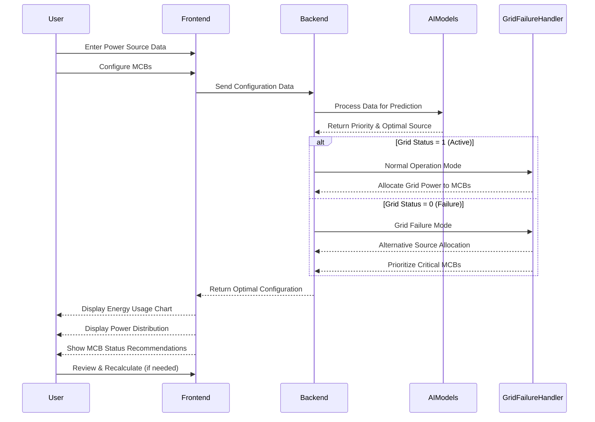

```mermaid
sequenceDiagram
    participant User
    participant Frontend
    participant Backend
    participant AIModels
    participant GridFailureHandler
    
    User->>Frontend: Enter Power Source Data
    User->>Frontend: Configure MCBs
    Frontend->>Backend: Send Configuration Data
    Backend->>AIModels: Process Data for Prediction
    AIModels-->>Backend: Return Priority & Optimal Source
    
    alt Grid Status = 1 (Active)
        Backend->>GridFailureHandler: Normal Operation Mode
        GridFailureHandler-->>Backend: Allocate Grid Power to MCBs
    else Grid Status = 0 (Failure)
        Backend->>GridFailureHandler: Grid Failure Mode
        GridFailureHandler-->>Backend: Alternative Source Allocation
        GridFailureHandler-->>Backend: Prioritize Critical MCBs
    end
    
    Backend-->>Frontend: Return Optimal Configuration
    Frontend-->>User: Display Energy Usage Chart
    Frontend-->>User: Display Power Distribution
    Frontend-->>User: Show MCB Status Recommendations
    
    User->>Frontend: Review & Recalculate (if needed)
```
